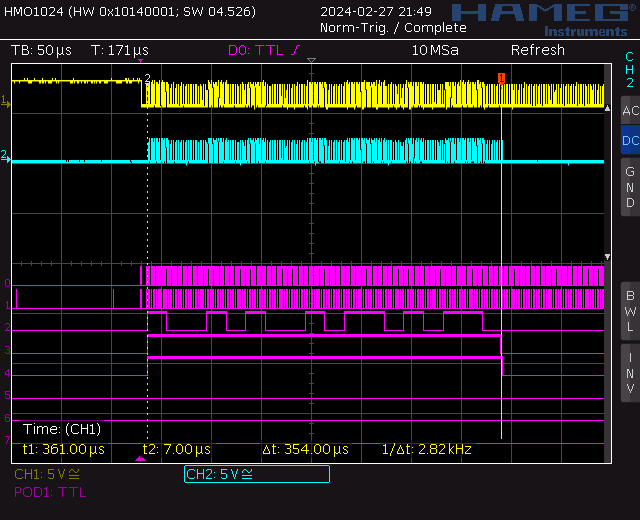
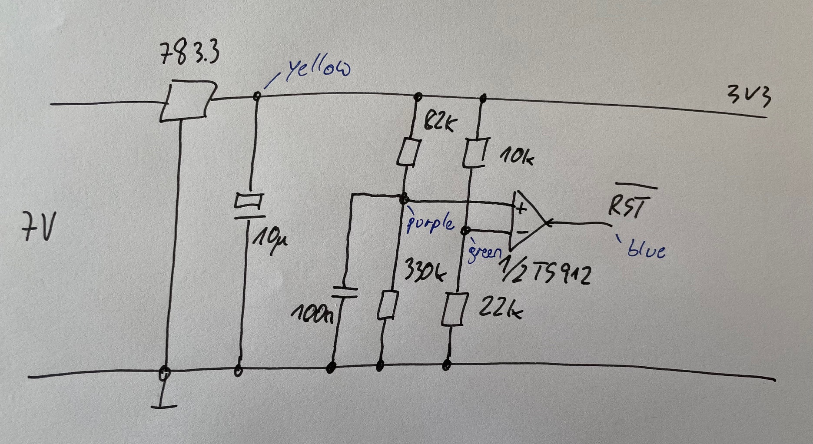
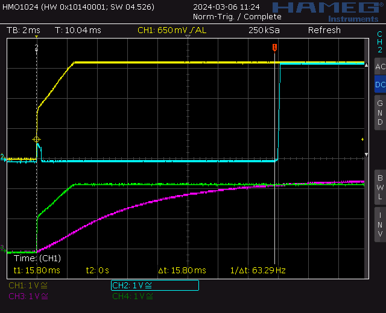

## Debugging

```
mspdebug rf2500 gdb

msp430-gdb -x firmware.gdb
```

Attention: the gdb in the TI toolchain package is broken, use the one from Debian


## Signals Working Cycler

These signals are related to code under tag `cycler_works_include_output_stage`.

First octets:


Last octets:


Schematics and legend for signals:


## Timing

Complete cycle: 2.48us


Short pulse: 550ns


Long pulse: 1.18us


## Load Time

During of loading data into five LEDs: 297us


During of loading data into six LEDs: 297us




| # of LEDs | Load Time measured | calculated |
| --------- | ------------------ | ---------- |
| 5         | 297us              |            | 
| 6         | 354us              | 356.4us    |
| 10        |                    | 594us      |
| 100       |                    | 5.9ms      |
| 200       |                    | 11.8ms     |


## Reset Circuitry

It appears that the output voltage of the power supply raises that slow, that the MCU
will not handle the reset correctly.

The following circuitry should generate a valid reset signal far enough from the raise 
of the supply voltage:



The circuit generates the following signals:



```math
3.3V \frac{22k}{22k + 10k} = 2.2V
```
