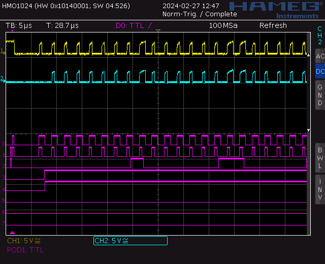
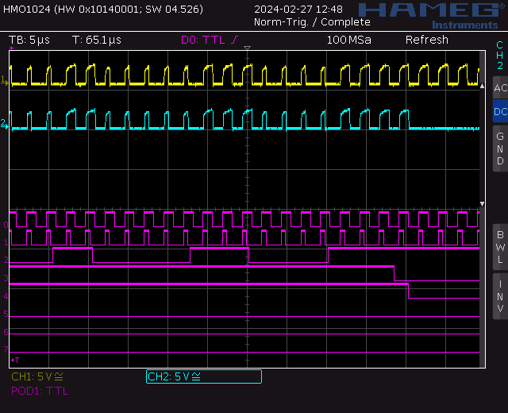
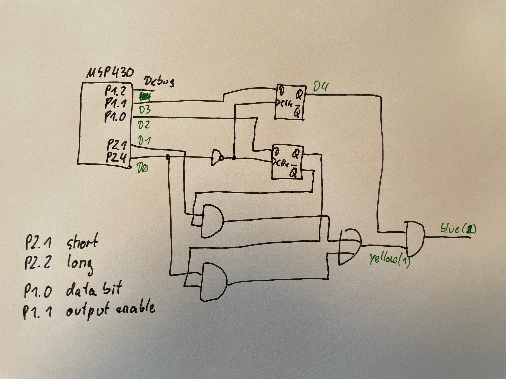
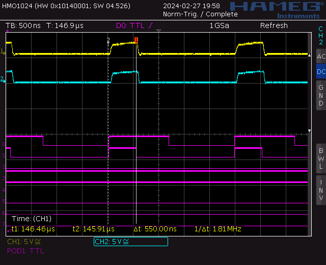
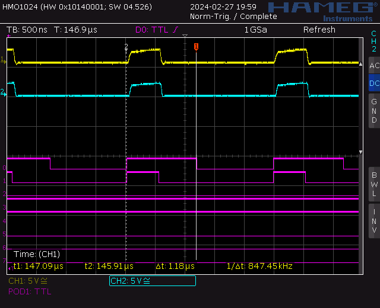
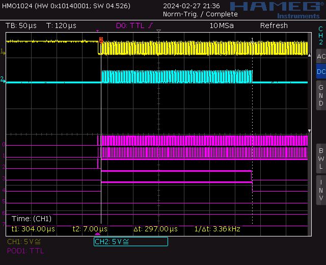

## Debugging

```
mspdebug rf2500 gdb

msp430-gdb -x firmware.gdb
```

Attention: the gdb in the TI toolchain package is broken, use the one from Debian


## Signals Working Cycler

These signals are related to code under tag `cycler_works_include_output_stage`.

First octets:



Last octets:



Schematics and legend for signals:




## Timing

Complete cycle: 2.48us


Short pulse: 550ns



Long pulse: 1.18us



During of loading data into five LEDs: 297us



| # of LEDs | Load Time |
| --------- | --------- |
| 5         | 297us     |
| 10        | 594us     |
| 100       | 5.9ms     |
| 200       | 11.8ms    |

