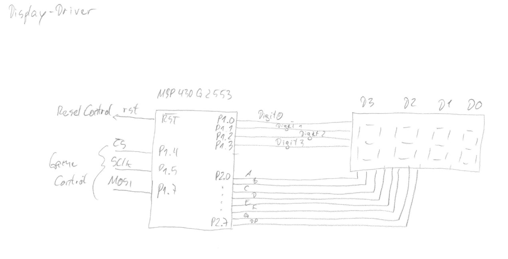

# Tetris - Hardware and Software

This Tetris implementation consists of a hardware and a software (running on that hardware).

The hardware utilizes four MSP430 microcontrollers for 1.) the game play, 2.) the play ground canvas, 3.) the score display and 4.) the sound effects.

Further documentation including calculations and drawing can be found in the `docs` subdirs of the four main subdirs.

## Game Play

Code is in subdir `game-ctrl` (https://gitea.hottis.de/wn/tetris/src/branch/main/game-ctrl).

In the firmware for this MSP430 microcontroller the whole game mechanics, reading the buttons, reading and writing the highscore EEPROM  and the control of the peripherial microcontrollers are implemented.

The buttons are debounced using RC circuitry and Schmitt triggers and connected to GPIOs of the microcontroller.

The peripherial microcontrollers and the EEPROM are connected via SPI including individual chip select lines.

## Play Ground Canvas

Code is in subdir `rgb-driver` (https://gitea.hottis.de/wn/tetris/src/branch/main/rgb-driver).

The play ground is implemented using a 10 * 20 matrix of PL9823 RGB LEDs which are controlled by another MSP430 microcontroller. The firmware for this microcontroller is implemented for performance and real time requirements in assembly code. Through some discret logic the signals for PL9823 LEDs are generated. Major challenge was to generated the signals according the datasheet of all 200 (including a mini canvas for the stone preview: 212) LEDs in real time without interrupts.

The communcation with the game play controller is implemented as a sequences of tuples of LED address (0 to 211) and color code. A single octet of 253 where the LED address is expected is taken as the end-of-telegram mark. Readiness to receive a telegram is signaled to the game play controller via a single line connected to a GPIO of the game play controller.

## Score Display

Code is in subdir `display-driver` (https://gitea.hottis.de/wn/tetris/src/branch/main/display-driver).

In the first place, a MAX7221 was meant to be used for connecting a multiple digit seven-segment display. However, it appears, that the MAX7221 requires 3.5V as minimum voltage for the high-level, which caan't be provided by the MSP430 (which runs on 3.3V) and level-shifters haven't been around. Thus, the minimal required amount of functionality of the MAX7221 has been implemented in C on an MSP430. Just four digits are supported. 

Communication with the game play controller is just a 16 bit number to be displayed.

## Sound Effects

Code is in subdir `sound-driver` (https://gitea.hottis.de/wn/tetris/src/branch/main/sound-driver).

An MSP430 microcontroller and two mediaeval AY-3-8913 sound chips are deployed. The sound chips themselve run on 5V, their 8-bit-address/data bus is connected to the port 2 (bit 0 to 7) of the microcontroller. The bus control signal `_CS`, `BC1` and `BDIR` are generated in software and provided via GPIOs.

An amplifier following the proposal of the AY-3-8913 datasheet is implemented using a LM386 chip. A MOSFET BS108 controlled via a GPIO is use the shortcut the input of the amplifier to ground to mute sound effects.

The clock generator proposed by the AY-3-8913 does not work reliably, so an alternative design from "The Art of Electronics" has been used.

 
 
 
 

