## Debugging

```
mspdebug rf2500 gdb

msp430-gdb -x firmware.gdb
```

Attention: the gdb in the TI toolchain package is broken, use the one from Debian


## Signals Working Cycler

These signals are related to code under tag `cycler_works_include_output_stage`.

First octets:

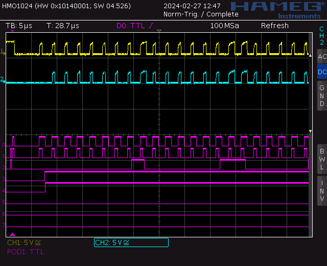

Last octets:


Schematics and legend for signals:

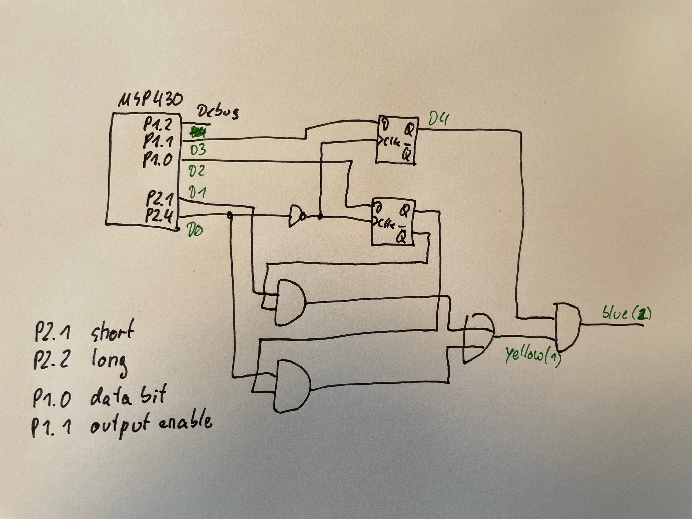

### Some more explanations

Consider above schematics and the screen shot "Last octets" from the oscilloscope.

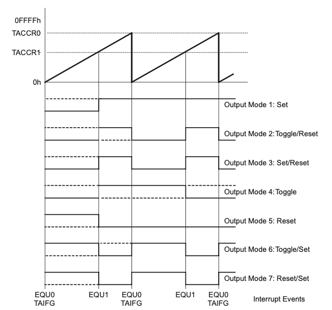

Timer TA1 is running in "up mode" to the value 45 set in compare register `TA1CCR0`. The compare registers `TA1CCR1` is set to 10, `TA1CCR2` is set to 22.
The output mode of the timer is set to "Reset/Set", which means the GPIO associated with `TA1CCR1` (P2.1) and `TA1CCR2` (P2.4) are set at the overflow and 
restart of the counter and reset when the counter matches the associated compare value.

So, on P2.1 (D1 on the oscilloscope) we have a long pulse and at P2.4 (D0 on the oscilloscope) we have a short pulse, with synchronous raising edge.

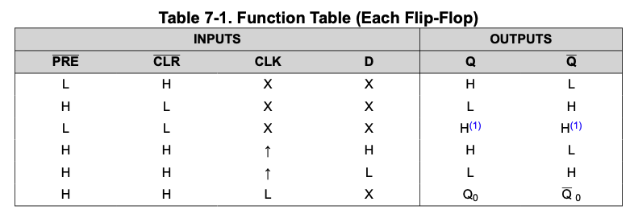

The inverted signal P2.4 is connected to the Clock input of a 74HC74 D-flipflop, the data input of the flipflop is connected to GPIO P1.0 (D2 on the oscilloscope).

The interrupt service routine `shifter_isr` is triggered by the overflow and restart of the timer, this interrupt service routine provides the next bit to be 
signaled on P1.0. This bit is stored at the falling edge of P2.4 (long pulse) in the flipflop.

The short pulse (P2.1, D1) is ANDed using a 74HC08 with the inverted output of the flipflop, the long pulse (P2.4, D0) is ANDed with the non-inverted output of
the flipflop, the ANDed results are ORed using a 74HC32.

So, at the output of the OR gate (yellow on the oscilloscope) we get a long pulse for a 1 at P1.0 provided by the ISR and a short pulse for a 0 at P1.0.

The routine `drawscreen` takes color values from the "frame buffer" beginning at `screendata` and translated them into the red, green and blue values and provides these values, first red, then green and finally blue to the ISR via the `DATA_REGISTER`.

The ISR cycles over the `DATA_REGISTER` and presents the bits at P1.0.

Additionally, when the first bit of a full draw screen cycle is presented at P1.0 by the ISR, it also sets the data enable signal at P1.1 and when the last bit has been provided it disabled the data enable signal. This signal is also synchronized using a flipflop and used to enable the short/long pulses using an AND gate.


## Timing

Complete cycle: 2.48us

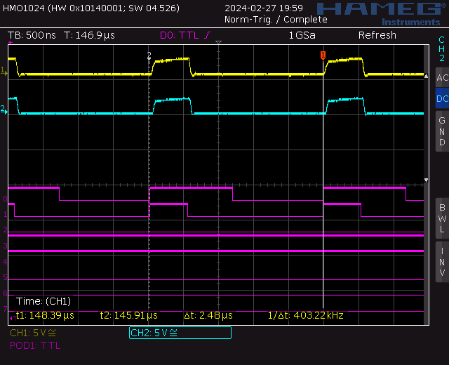

Short pulse: 550ns

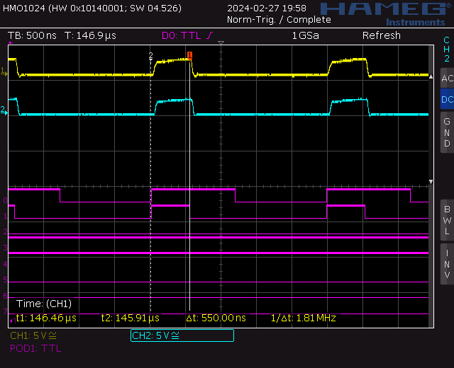

Long pulse: 1.18us

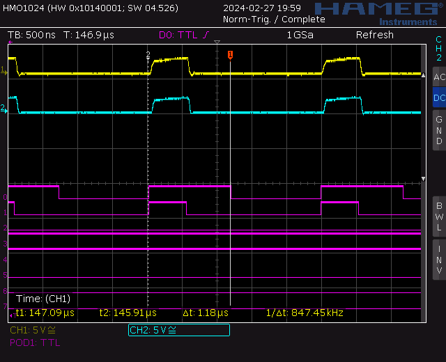


## Load Time

During of loading data into five LEDs: 297us

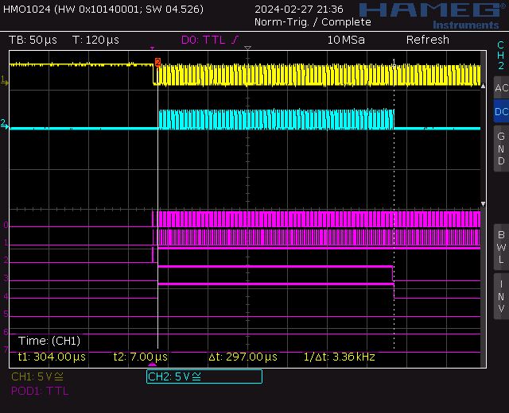

During of loading data into six LEDs: 297us

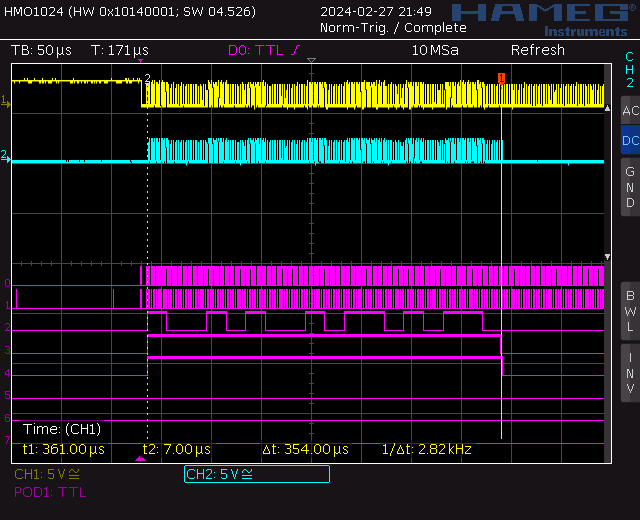


| # of LEDs | Load Time measured | calculated |
| --------- | ------------------ | ---------- |
| 5         | 297us              |            | 
| 6         | 354us              | 356.4us    |
| 10        |                    | 594us      |
| 100       |                    | 5.9ms      |
| 200       |                    | 11.8ms     |


## Reset Circuitry

It appears that the output voltage of the power supply raises that slow, that the MCU
will not handle the reset correctly.

The following circuitry should generate a valid reset signal far enough from the raise 
of the supply voltage:

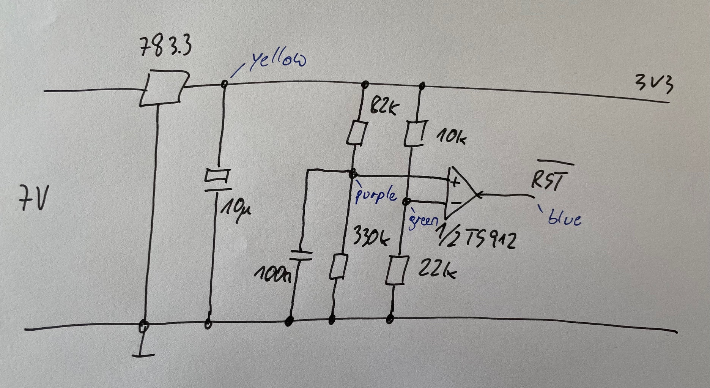

The circuit generates the following signals:

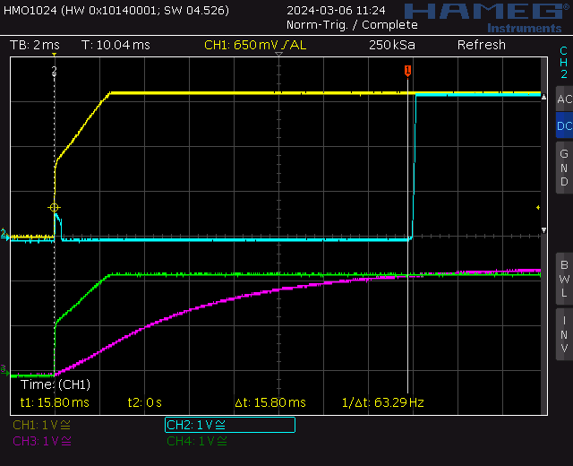

#### Reference voltage (green):

```math
U_ref = 3.3V \frac{22k\Omega}{22k\Omega + 10k\Omega} = 2.2V
```  
  

#### Trigger voltage (purple):

```math
U_trigg = 3.3V \frac{330k\Omega}{330k\Omega + 82k\Omega} = 2.64V
```  
  

#### RC constant:

```math
\tau = 82k\Omega \cdot 100nF = 8.2ms
```  
